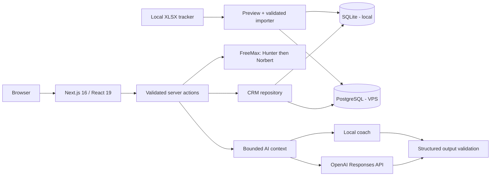

<p align="center">
  
</p>

<h1 align="center">GUD CRM</h1>

> A calm, fast CRM for teams who care more about the next good conversation than feeding a database.

GUD CRM turns sales research into an operating rhythm: a separate target pool, one visible sales pipeline, clear context about what is being pitched, and one owned next action. It runs locally with persistent SQLite in about two minutes, grows into PostgreSQL on a VPS, and includes an on-demand AI outreach coach that never sends anything for you.

The bundled workspace uses fictional `DEMO ·` records and a single core product. It demonstrates the workflow without publishing any operating company, contact or outreach data.

GUD is one **Sales Workspace** with two sales models: **Focused Sales** for a single product, SaaS offer or tightly connected product family, and **Service Sales** for agencies and consultancies pitching several kinds of project or retainer. Both share the same secure CRM core. The product ends at a clean client handoff rather than expanding into project delivery, invoicing or support. See [the product charter](docs/product/PRODUCT-CHARTER.md), [sales models](docs/product/EDITIONS.md), [development environments](docs/product/DEVELOPMENT.md) and the [public-release privacy checklist](docs/PUBLIC-RELEASE.md).

## What is already useful

| Workspace | What you can do |
| --- | --- |
| Research | Keep possible targets off the sales board, review evidence and contact routes, hand structured packs to Codex or Cowork without a CRM API, merge returned JSON safely, and promote only after human review. |
| Offers | Define the products or services you pitch once. A second active offer quietly unlocks contextual filters, labels, reporting, playbook assets and AI grounding across the CRM. |
| Pipeline | Drag or keyboard-move opportunities, filter by owner/attention, switch between comfortable and compact cards, and understand every stage from its inline guide. |
| Opportunity | Work in a wide, expandable relationship workspace with editable company fit/scale, contact details, tasks, outreach rhythm, timeline, logging, and AI together. |
| Activity | Log each attempt, channel and outcome in seconds; optionally create the follow-up in the same move. |
| AI coach | Ask for the best next move, an outreach draft, creative routes, or cold-lead recovery. |
| Today | Land on five ranked next moves, a compact pipeline pulse and only the relationships that need a decision; expand the full schedule when needed. |
| Companies | Add a company manually, sort by fit/name/contact coverage/pipeline order, then jump into live work. Every manually added company gets a research card so it cannot vanish between lists. |
| Search | Find companies, people, notes, outcomes, roles, and opportunity context. |
| Reports | See pipeline health, stage distribution, workload, channel mix, and attention gaps. |
| Playbook | Navigate a visual outreach loop, multi-channel cadence, guardrails and adaptable patterns; track the readiness, link and owner of six essential sales assets. |
| Settings | Manage the team, roles and offer library; rename the pipeline; download a consistent SQLite backup; edit activity types; understand stage semantics; control AI; and configure the server-side OpenAI key. |
| Import | Preview the research tracker, validate all expected columns, detect duplicates, then import it idempotently from Settings or the CLI. |

The design principle is simple: important work should be obvious, updates should be quick, and the system should help a human make a better decision without pretending to be the human.

## Start every session on Today

After sign-in, GUD opens **Today**, not the full board. It answers three questions without turning into another dashboard:

1. **What should I do next?** Five owned actions are ranked by overdue state, priority, temperature, pipeline progress and date.
2. **Where is the pipeline?** A small pulse shows how many opportunities are ready, in outreach, in a live conversation or in nurture.
3. **What needs a decision?** Records without an owned next step, marked at risk, unresponsive or overdue are surfaced separately.

The complete schedule is one collapsed section below this command centre. The Pipeline remains the place to understand and move the whole book of work; Today is the place to begin working.

Research is deliberately outside the sales journey. A possible target remains in the Research Hub until a person promotes it. The active pipeline is intentionally outcome-led:

`Ready to contact → Outreach active → Engaged → Discovery booked → Trial proposed → Trial active → Won`

Three side outcomes stay out of that compulsory journey: **Research holding** keeps market-map, reference, weak-route, paused, or no-fit desk research without pretending it was a sales loss; **Nurture** is only for a real relationship with inactive timing plus a recorded re-entry trigger; **Lost** is reserved for a genuine post-contact commercial loss. Sending an overview or useful diagnostic is an activity, not a pipeline gate; several LinkedIn, email, phone, or physical attempts can live cleanly inside **Outreach active** until a person engages. Every opportunity shows attempt count, channel coverage, latest outcome, activity history, and the next owned action.

The bundled roster is fictional. Admins manage users and workspace controls; managers can import and maintain sales assets; sales support can work opportunities, contacts, activities and tasks but cannot manage team access or workspace settings. Real users and PostgreSQL seed credentials remain environment-controlled.

## One focus, several kinds of work

Offers are the intentionally small abstraction that lets the same CRM handle a website project, retainer, consultancy engagement or specialist product without weakening its focus.

- A new workspace begins with one default offer. In that state, there is no offer filter, no extra badge on every card, and no additional step in the normal workflow.
- An admin adds another offer in **Settings → Offers** with a name, colour, short description, ideal customer and positioning. That is the moment multi-offer controls become visible.
- Research targets may stay unassigned while the team is still deciding what is relevant. Before a target reaches the live pipeline, the offer must be chosen.
- The pipeline, Companies, My work and Reports can focus on one offer or show all. Offer labels appear only in mixed views where the distinction matters.
- One company can have several opportunities for different offers. The existing company/contact and opportunity/contact model keeps those pitches connected to the same relationship without duplicating the company.
- The AI coach receives the selected offer’s description, ideal customer and positioning. It does not blend another service into the draft.
- Each offer has its own six-item sales asset kit in the Playbook. Existing assets migrate to the default offer automatically.
- Offers with history are archived, not deleted. Old activity and reporting retain their meaning.

The pipeline stages remain shared. That is deliberate: one operating language keeps reporting and team habits coherent. Separate stage models should only be introduced later if real usage proves that two sales motions cannot honestly share the same outcomes.

## Start locally in two minutes

Requirements: Node.js 24 LTS and npm. The repository includes `.nvmrc`, `.node-version`, an engine constraint, and a Node 24 Docker image so local, CI, and live runtimes agree.

```powershell
git clone https://github.com/paolodit/gud-crm.git
cd gud-crm
npm install
npm run dev
```

Open [http://localhost:3000](http://localhost:3000). Choose **Open local workspace** and GUD lands on Today.

With no environment file, GUD CRM uses SQLite at `data/gud-crm.db`, creates the schema automatically, and boots a useful starter workspace. Changes survive refreshes and restarts. Local mode deliberately has no login ceremony; it is intended for fast development and single-user evaluation.

To run several private instances from this one checkout, copy `config/instances.example.json` to the ignored `config/instances.local.json`, add one entry per workspace, then run `npm run dev:instance -- <name>`. Each entry supplies its own label, sales model, SQLite database and port. The label is shown in the navigation so it is always clear which instance is open.

Useful local data commands:

```powershell
npm run db:local:status                 # counts and database location
npm run db:local:export                 # export a readable JSON backup
npm run db:local:reset                  # reset to the starter workspace
```

The `data/` directory is ignored by Git. Do not commit a real CRM database or an export containing personal data.

Settings also has **Download SQLite backup**, which uses SQLite’s online backup API to produce a consistent `.sqlite` copy while the app is running. This is the deliberately light local strategy: download after meaningful work and store it away from the development machine. Once deployed, use encrypted daily PostgreSQL/volume snapshots with retention and restore tests; do not email a database containing contact details.

### Choose a runtime explicitly

Copy `.env.example` to `.env.local` when you want explicit configuration:

```powershell
Copy-Item .env.example .env.local
```

```dotenv
DATA_BACKEND=sqlite          # fastest local development; persistent
SQLITE_PATH=data/gud-crm.db
```

Other supported values are `demo` for a reset-on-refresh showcase and `postgres` for authenticated multi-user deployment.

## The AI coach

AI in GUD CRM is an on-demand opportunity coach, not a generic chat box.

It uses bounded, relevant context from the current record:

- company, sector, fit, and scale;
- linked contacts and decision-maker coverage;
- stage, temperature, priority, owner, and outreach angle;
- the eight most recent activities and eight relevant tasks;
- an approved outreach playbook;
- do-not-contact state, overdue promises, channel repetition, and other warnings.

Every response has a validated structure:

- a relationship summary;
- up to three next actions with reason, timing, and confidence;
- LinkedIn/email/call/letter drafts to adapt;
- sensible, distinctive, and bold creative ideas with cost bands;
- safety and relationship warnings;
- provider/model/prompt provenance and token metadata;
- feedback: Useful, Not useful, or Already tried.

You can copy a draft or turn a suggested action into a real dated task. Nothing is auto-sent, auto-scheduled, or silently executed. CRM text is treated as untrusted reference data, provider output is schema-validated, generation is rate-limited, and the UI labels every result for human review.

### Zero-key local coach

The default provider is deterministic, instant, private to the process, and needs no API key:

```dotenv
AI_ENABLED=true
AI_PROVIDER=local
```

This is ideal for product development, demos, and verifying the complete coaching workflow without API cost.

### OpenAI provider

To get model-generated coaching, use the OpenAI Responses API adapter:

```dotenv
AI_ENABLED=true
AI_PROVIDER=openai
AI_MODEL=gpt-5.6-luna
OPENAI_API_KEY=your-key-here
AI_TIMEOUT_MS=30000
AI_RATE_LIMIT=6
```

Restart the app after changing provider settings. Workspace admins can enable or disable the coach from Settings, where **Configure OpenAI** gives a copy-ready server configuration and a direct route to project API keys. The app intentionally never accepts the live secret in a browser form: keep API keys in `.env.local`, VPS/CapRover secret variables, or a managed secret store—never browser code or Git.

## Research handoff and enrichment

The Research Hub keeps target finding out of the live opportunity board. A target can be added manually or imported from the tracker, researched in GUD CRM, or handed to Codex/Cowork through a copy-ready brief and versioned JSON pack. Returned JSON is matched by IDs, domain, then normalised name; existing notes, source URLs and contacts are merged rather than replaced. Importing never promotes a target.

Named contact enrichment is deliberately one-at-a-time. **FreeMax** uses free resources in the order that preserves the most future value: Hunter's recurring monthly allowance first, then Voila Norbert's one-off starter pool only when Hunter misses or is unavailable. Add either or both server keys, restart the app, then use **Find work email** beside an already-identified contact:

```dotenv
HUNTER_API_KEY=your-hunter-key
VOILA_NORBERT_API_KEY=your-norbert-key
HUNTER_FREE_MONTHLY_LIMIT=50
NORBERT_FREE_LIFETIME_LIMIT=50
```

The action requires a confirmed company website and contact name, refuses do-not-contact records, and records provider provenance in the audit log. It never calls Norbert after a Hunter success, never verifies again automatically, and stops at GUD CRM's configured free-first safety caps. Failed finds use no finder credit with either provider. The small allowance readout is GUD CRM's tracked usage; the provider dashboard remains authoritative if the same account is used elsewhere or is on a paid plan. Keys are never exposed to browser code.

Hunter currently provides 50 free credits each month with API access. Norbert provides the first 50 successful leads free; this is a starter pool, not a monthly refill. Provider terms can change, so the limits are environment-controlled instead of hard-coded into the workflow.

## Move to PostgreSQL on a VPS

SQLite is the right development default here: it is fast, persistent, disposable, and removes infrastructure from the inner loop. PostgreSQL remains the production system of record because it gives the multi-user app stronger concurrent writes, relational reporting, authentication boundaries, migrations, backups, and operational tooling.

For the database only:

```powershell
Copy-Item .env.example .env
# Edit .env: set DATA_BACKEND=postgres and replace every example secret.
docker compose up -d db
npm run db:migrate
npm run db:seed
npm run dev
```

For the complete application stack:

```powershell
docker compose up --build
```

Sign in with the seed administrator configured by `SEED_ADMIN_EMAIL` and `SEED_ADMIN_PASSWORD`. The seed now refuses to run without an explicit 12+ character password. Docker Compose also refuses to start without explicit database, auth and public HTTPS settings, so an example secret or the local SQLite default cannot silently become production configuration.

### Team access and password recovery

SQLite stays intentionally single-session: it is the fast development workspace, not a fake multi-user security boundary. You can prepare the team roster and roles locally, then PostgreSQL activates separate Better Auth accounts.

In PostgreSQL mode an admin can add a user with a temporary password, edit their name/email/role, reset their password, or deactivate them. Deactivation revokes their sessions. Public sign-up is disabled. Password-reset links appear on the sign-in screen only when a real email sender is configured:

```dotenv
RESEND_API_KEY=re_...
AUTH_FROM_EMAIL=GUD CRM <crm@your-domain.example>
```

Reset tokens are time-limited by Better Auth and a successful reset revokes other sessions. Keep the Resend key in VPS/CapRover secrets, never in browser code.

### Environment reference

| Variable | Default | Purpose |
| --- | --- | --- |
| `DATA_BACKEND` | inferred | `sqlite`, `demo`, or `postgres`; SQLite is used when no database URL exists. |
| `SQLITE_PATH` | `data/gud-crm.db` | Local database location. |
| `GUD_DEFAULT_MODEL` | `focused` | `focused` or `service`; used only when creating a new workspace. Existing workspaces keep their saved model. |
| `GUD_INSTANCE_NAME` | `Local sales workspace` | Private deployment label shown in the navigation. |
| `LOCAL_TRACKER_PATH` | `data/imports/outreach-tracker.xlsx` | Optional local workbook shown in Settings; keep it outside Git. |
| `DATABASE_URL` | none | PostgreSQL connection string; required with `DATA_BACKEND=postgres`. |
| `BETTER_AUTH_SECRET` | none in PostgreSQL | Required random 32+ character secret for persistent multi-user use. |
| `BETTER_AUTH_URL` | none | Canonical application URL for production authentication. |
| `NEXT_PUBLIC_APP_URL` | `http://localhost:3000` | Browser-facing application URL. |
| `RESEND_API_KEY` | none | Server-only Resend credential; enables password-reset email with `AUTH_FROM_EMAIL`. |
| `AUTH_FROM_EMAIL` | none | Verified sender used for account recovery. |
| `AI_ENABLED` | `true` | Deployment-level AI kill switch. |
| `AI_PROVIDER` | `local` | `local` or `openai`. |
| `AI_MODEL` | `gpt-5.6-luna` | OpenAI model used by the provider adapter. |
| `OPENAI_API_KEY` | none | Server-only API credential for the OpenAI provider. |
| `HUNTER_API_KEY` | none | Server-only Hunter key; FreeMax tries this recurring allowance first. |
| `VOILA_NORBERT_API_KEY` | none | Server-only Norbert key; used only after a Hunter miss or skip. |
| `HUNTER_FREE_MONTHLY_LIMIT` | `50` | Local monthly safety cap for successful Hunter finds initiated by GUD CRM. |
| `NORBERT_FREE_LIFETIME_LIMIT` | `50` | Local lifetime safety cap for successful Norbert starter finds initiated by GUD CRM. |
| `COMPANIES_HOUSE_API_KEY` | none | Reserved server-only key for UK company validation. |
| `GOOGLE_MAPS_API_KEY` | none | Reserved server-only key for location checks with quota controls. |
| `AI_TIMEOUT_MS` | `30000` | Provider timeout, 5-120 seconds. |
| `AI_RATE_LIMIT` | `6` | Suggestions per user per 15-minute window. |

`GET /api/health` reports the active mode and database availability without exposing credentials or the SQLite path.

For a first workspace, daily operating rhythm, backup routine and launch handoff, use [Getting started](docs/GETTING-STARTED.md) and [Operations](docs/OPERATIONS.md). The implemented controls, dependency findings, accepted development-only exception and verification commands are recorded in [Security](docs/SECURITY.md).

## Import an outreach tracker

Source workbooks are intentionally ignored by Git. Preview one first:

```powershell
npm run import:tracker -- "C:\path\to\outreach-tracker.xlsx"
```

The preview checks the 23-column contract and reports row totals, unique companies, contacts, duplicate source rows, invalid rows, and stage mapping. Nothing is written. The same preview is visible in **Settings → Tracker import**; when it is clean, **Import into workspace** performs the write.

For local SQLite, commit after reviewing the preview—no organisation ID or database server is required:

```powershell
npm run import:tracker -- "C:\path\to\tracker.xlsx" --commit
```

For PostgreSQL, select the destination organisation:

```powershell
$env:ORGANISATION_ID="00000000-0000-4000-8000-000000000001"
$env:IMPORT_USER_ID="your-auth-user-id" # optional
npm run import:tracker -- "C:\path\to\tracker.xlsx" --commit
```

Both import paths are checksum-protected and safe to rerun. Companies match by normalised domain first and normalised name second; contacts are deduplicated within their company. Workbook `Paused`, `Watch`, `Closed`, and no-fit research rows map to **Research holding**, never Lost or Nurture. SQLite preserves the research note, source URLs, people-search URL, buyer roles, priority reason, scale, fit, outreach angle, next action and every named contact. PostgreSQL additionally keeps the original row as import metadata and commits transactionally.

When exactly one offer is active, tracker and research imports assign it automatically. With several offers, structured research can supply `offerId` or `offerName`; otherwise the new record stays unassigned in Research and cannot be promoted accidentally. This keeps bulk imports quick without guessing the service being pitched.

## Architecture



- UI: Next.js App Router, React, TypeScript, dnd-kit, Lucide, responsive custom CSS.
- Local data: SQLite with WAL, automatic bootstrap, audit events, AI feedback, and rate-limit state.
- Production data: PostgreSQL and Drizzle ORM with committed migrations.
- Identity: Better Auth with organisation membership and role fields in PostgreSQL mode.
- Access control: admin/manager/sales-support separation, admin-managed accounts, session revocation on deactivation, optional Resend-backed password recovery, and disabled public sign-up.
- Safety: organisation-scoped writes, audit records, explicit preview/commit boundaries, no automatic outreach.
- AI: provider interface, bounded context assembly, Zod structured outputs, local/OpenAI adapters, timeouts, rate limits, and human feedback.

## Repository map

```text
src/app/                  routes, health endpoint, and server actions
src/components/           interactive CRM workspaces
src/db/schema.ts          PostgreSQL organisation-scoped model
src/lib/ai/               context, schemas, and provider adapters
src/lib/data/             SQLite store and shared read repository
src/lib/import/           XLSX preview and transactional import
drizzle/                  committed PostgreSQL migrations
scripts/                  seed, import, and local database utilities
business dev/             product plan and non-runtime working material
```

## Development commands

```powershell
npm run dev               # local development server
npm run typecheck         # strict TypeScript check
npm run lint              # ESLint
npm test                  # domain, import, and AI contract tests
npm run security:audit    # advisories plus the documented dev-only exception
npm run privacy:audit     # tracked data files and non-placeholder identities
npm run build             # production build
npm run start             # serve .next/standalone
npm run auth:smoke        # real HTTP auth flow against a running PostgreSQL app
npm run db:generate       # generate a PostgreSQL migration
npm run db:migrate        # apply committed PostgreSQL migrations
npm run db:seed           # seed the PostgreSQL workspace
```

Before opening a pull request, run typecheck, lint, tests, and build. Changes involving personal data, imports, authentication, attachments, or AI should include a brief threat/privacy note.

### Data-safe upgrades

SQLite snapshots are versioned and migrated in place. The Offer upgrade is additive: it creates a default core offer and links every existing opportunity without replaying older roster, stage or example-data migrations. PostgreSQL migration `0002_charming_morlun.sql` creates the relational offer table, seeds one default offer per existing organisation, then links existing opportunities before adding indexes and the foreign key. Back up before deployment as usual; do not reset a real local workspace to pick up a schema change.

## Production checklist

1. Select `DATA_BACKEND=postgres`; use a separately backed-up PostgreSQL database.
2. Store strong auth, database, and provider secrets outside the repository; the app now refuses an insecure PostgreSQL auth configuration.
3. Terminate TLS at Caddy, nginx, or the platform edge and set the canonical HTTPS auth URL.
4. Run migrations as an explicit release step before starting the new image.
5. Back up PostgreSQL and the persistent `/app/uploads` volume daily; encrypt backups, retain multiple restore points, and test restores.
6. Keep trackers, SQLite databases, exports, and uploads outside Git and limited to authorised staff.
7. Review retention, lawful-basis, suppression, access, and deletion obligations before loading real personal data.
8. Run the committed CI checks, including the PostgreSQL sign-in/session/sign-out smoke test and dependency audit.
9. Red-team prompts and review AI outputs before enabling the OpenAI provider for real customer context.

Attachment schema/storage foundations exist, but authenticated upload/download routes are still roadmap work. The coach deliberately remains advisory and on demand.

## Roadmap

- Authenticated attachment delivery with size/type limits and a malware-scanning hook.
- Admin-managed playbook and message templates used directly by the coach.
- Organisation-wide privacy export/delete tooling and fuller suppression audit workflows.
- Stage conversion and time-in-stage reporting from history.
- Broader browser regression coverage beyond the committed PostgreSQL authentication smoke test.
- A reviewed SQLite-to-PostgreSQL promotion/import command before the first VPS cutover.

## Licence

GUD CRM is released under the [MIT Licence](LICENSE). Copyright (c) 2026 paolodit.
