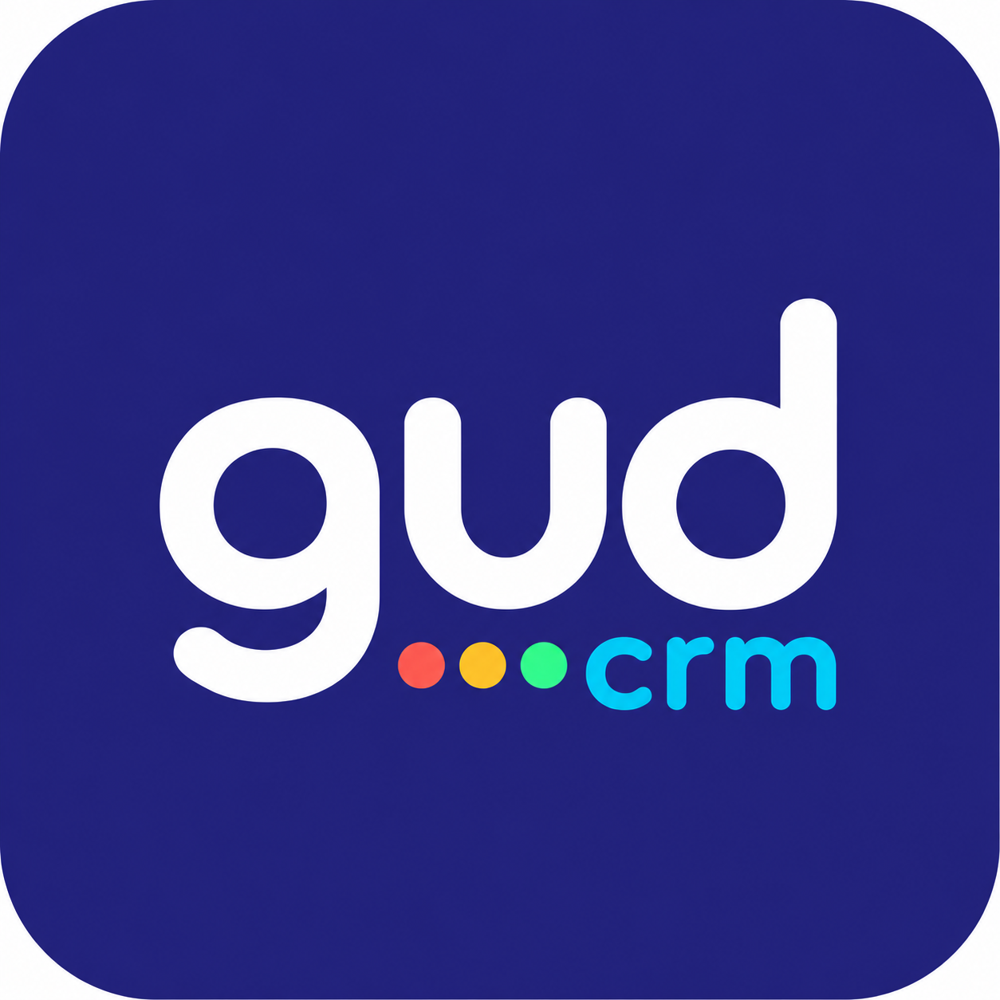

<p align="center">
  
</p>

<h1 align="center">GUD CRM</h1>

<p align="center"><strong>A focused sales workspace for the work before a client says yes.</strong></p>

<p align="center">
  Understand the opportunity. Keep the relationship clear. Know the next move.
</p>

<p align="center">
  Made with care by <a href="https://www.refreshcreative.com">Refresh</a>.
</p>

GUD CRM is for small sales teams, agencies, consultancies, SaaS companies and independent specialists who want useful sales discipline without traditional CRM sprawl.

It keeps ideas, targets and live opportunities distinct; makes the whole pipeline readable at a glance; and gives every active relationship an owner, context and a next action. AI is available as an optional research and coaching layer, never an automatic salesperson.

## Why GUD feels different

- **The pipeline is the home screen.** See the whole book of work, spread a busy stage across two lanes and drag opportunities into the order that makes sense.
- **Research stays out of live sales.** Explore market ideas separately, build named targets before outreach, then promote only credible opportunities.
- **One product or several services.** Focused Sales suits a single product or SaaS motion. Service Sales suits agencies and consultancies pitching different projects, retainers and advisory work.
- **Updates are quick.** Type, use browser speech input, or log a touch and its follow-up together.
- **Relationships remain human-readable.** Companies, contacts, evidence, activities, tasks, value and decision context stay connected.
- **AI is bounded and reviewable.** Draft outreach, explore angles, prepare research and ask for a next move without auto-sending anything.
- **Your existing AI workspace can connect.** The optional MCP endpoint lets authorised Codex, ChatGPT and compatible clients read or update GUD through a narrow, auditable tool surface.
- **Free enrichment goes further.** Optional Hunter and Voila Norbert integrations use a visible, free-first provider order for one-contact-at-a-time email discovery.

GUD stops at a clean client handoff. It is not trying to become project management, invoicing, service delivery or support software.

## Choose your sales model

| Model | Best for | What changes |
| --- | --- | --- |
| **Focused Sales** | One product, SaaS offer or closely related product family | A single clear offer and a direct target-to-pipeline motion |
| **Service Sales** | Agencies, consultancies and specialists | Multiple offers, project types and market ideas without duplicating the CRM |

Both models use the same application and data model. A workspace can be configured without maintaining a separate codebase.

## Try it in two minutes

Requirements: [Node.js 24](https://nodejs.org/) and npm.

```bash
git clone https://github.com/paolodit/gud-crm.git
cd gud-crm
npm ci
npm run demo:service
```

Open [http://localhost:3201](http://localhost:3201). The demo contains fictional records, needs no login and resets when restarted.

For the single-product journey instead:

```bash
npm run demo:focused
```

Open [http://localhost:3200](http://localhost:3200).

## Start a persistent local workspace

```bash
npm run dev
```

Open [http://localhost:3000](http://localhost:3000) and choose **Open local workspace**. GUD creates a persistent SQLite database at `data/gud-crm.db`; `data/` is ignored by Git.

SQLite mode is deliberately a trusted local workspace without individual user authentication. It is excellent for development and personal evaluation, but it must not be exposed directly to the internet.

Useful local commands:

```bash
npm run db:local:status
npm run db:local:backup
npm run db:local:export
```

See [Getting started](docs/GETTING-STARTED.md) for the first useful setup session and [Sales models](docs/product/EDITIONS.md) for the model differences.

## Run it for a team

Live multi-user workspaces use PostgreSQL, Better Auth and HTTPS. Every organisation should have its own database, database user, authentication secret and hostname.

| Route | Use it when | Guide and tooling |
| --- | --- | --- |
| **Docker Compose** | You control a Linux server or want a production-like local stack | [`docker-compose.yml`](docker-compose.yml), [`Dockerfile`](Dockerfile), [Docker guide](docs/DOCKER.md) |
| **CapRover** | You want simple app deployment, domains and TLS on a VPS | [`captain-definition`](captain-definition), [CapRover guide](docs/CAPROVER.md) |

The production image:

- builds the Next.js standalone server on Node 24;
- runs committed PostgreSQL migrations before the web server starts;
- bootstraps a new workspace only when explicitly enabled;
- runs as a non-root user;
- exposes a database-aware health check at `/api/health`;
- keeps application containers stateless so database backups and deployments remain separate concerns.

Generate strong first-install secrets:

```bash
npm run deploy:secrets
```

Validate a private deployment environment without printing secret values:

```bash
npm run deploy:check -- --env .env
```

Then follow either the [Docker](docs/DOCKER.md) or [CapRover](docs/CAPROVER.md) walkthrough. Do not use the sample values unchanged.

## Data safety

The public repository contains application code and fictional demo fixtures only. Real CRM records, imports, SQLite databases, deployment worksheets, uploads, API keys and environment files are ignored and checked by the privacy audit.

Before every live deployment:

1. create and verify a fresh PostgreSQL backup;
2. deploy the same tested commit or image to each instance;
3. confirm `/api/health` reports a connected PostgreSQL database;
4. test sign-in and one read/write workflow;
5. keep the previous image available for application rollback.

A code rollback does not undo a database migration. Restore testing belongs in an isolated database, never over the only live copy.

Read [Operations and backups](docs/OPERATIONS.md), [VPS deployment](docs/VPS-DEPLOYMENT.md) and the [Security guide](docs/SECURITY.md) before inviting a live team.

## Optional AI, MCP and enrichment

All three integrations are off or local-first by default:

- The built-in deterministic coach needs no API key. Set `AI_PROVIDER=openai` and provide a server-side key only when model-generated coaching is wanted.
- Remote MCP access is available only in authenticated PostgreSQL mode and must be enabled with `MCP_ENABLED=true`.
- Hunter and Voila Norbert keys can be connected by an administrator and are encrypted server-side. GUD never puts provider keys in browser code.

Nothing is auto-sent, auto-scheduled or silently promoted into the pipeline. External research is treated as untrusted evidence and remains subject to human review.

Configuration examples live in [`.env.example`](.env.example). The fuller contracts are documented in [Security](docs/SECURITY.md) and the [CapRover MCP section](docs/CAPROVER.md#3-configure-runtime-variables).

## Development

```bash
npm run lint
npm run typecheck
npm test
npm run test:e2e
npm run build
npm run privacy:audit
npm run security:audit
```

The CI workflow repeats the quality, privacy, dependency, PostgreSQL migration and authentication checks on every pull request.

Repository map:

```text
src/app/                 Next.js routes and server actions
src/components/          CRM interface and workflows
src/lib/                 Auth, data access, AI, MCP and integrations
src/db/                  Schema, migrations and fixtures
scripts/                 Backups, imports, deployment and test helpers
docs/                    Setup, operations, security and product contracts
public/                  Public brand assets
```

Before proposing a change, run the quality commands above and keep the interface purposeful, data-safe and useful at first glance. Review the [security posture](docs/SECURITY.md) before working on authentication, data access or external integrations.

## Documentation

- [Getting started](docs/GETTING-STARTED.md)
- [Docker installation](docs/DOCKER.md)
- [CapRover installation](docs/CAPROVER.md)
- [Operations and backups](docs/OPERATIONS.md)
- [Security model](docs/SECURITY.md)
- [Public-release privacy checklist](docs/PUBLIC-RELEASE.md)
- [Product charter](docs/product/PRODUCT-CHARTER.md)
- [Sales models](docs/product/EDITIONS.md)

## Licence

GUD CRM is released under the [MIT Licence](LICENSE).
